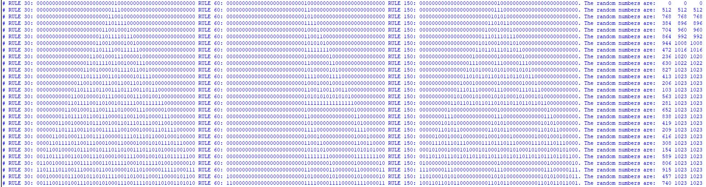

# Cellular Automaton Based Pseudo Random Number Generator (CA-based PRNG)

> SystemVerilog CA-based PRNG module   

Implementention in SystemVerilog of __CA-based PRNG__.  

Principle of operation of 1D cellular automaton can be found in [Mathworld](https://mathworld.wolfram.com/ElementaryCellularAutomaton.html).
Programmable CA-based PRNG
	-Configurable number of CA array
	-Configurable number of neighbors
	-Configurable CA rule (i.e. 'rule 30', 'rule 150', etc.)
	-Configurable pseudo random number width

- Conceptual block diagram of a CA-based PRNG module:

	 

## Get Started

The source files  are located at the repository root:

- [CA cell](./CA_Cell.sv)
- [CA_Array](./CA_Array.sv)
- [CA_PRNG](./CA_PRNG.sv)
- [High_arch_PRNG instantiating multiple CA_PRNG modules](./High_arch_PRNG.sv)

## CA-based PRNG Architecture Parameters
- ARRAY_WIDTH : Width of the one-dimensional CA grid
- NEIGHBORHOOD : Number of neuighboring cells
- RULE : Cellular automaton rule
- N : Random number width
- LOCATION : Bit location for random number generation

## Testbench

- 100 iterations of three PRNG with different CA rules ('rule 30', 'rule 60', 'rule 150') 

	 

## Support

I will be happy to answer any questions.  
Approach me here using GitHub Issues or at tom.urkin@gmail.com